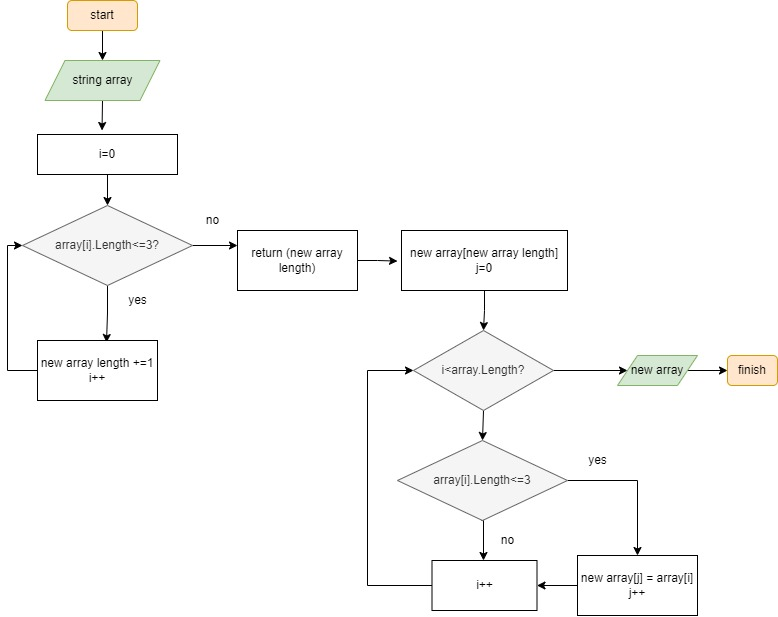

**Инструкция**
---
1. Запрашиваем на ввод строковый массив.
2. Считаем сколько нужных элементов с помощью цикла.
3. Создаем новый строковый массив с длинной в полученном в пункте 2 величиной.
4. Запускаем цикл который скопирует необходимые элементы в новый массив.

***Схема***
---
